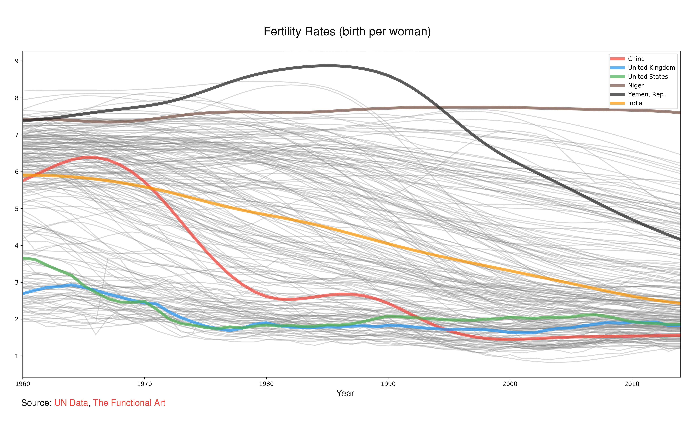

Portfolio
=========

Showcase of data processing and machine learning techniques for different data sets.

## Inside this repository

### IRIS

Very simple use of the iconic IRIS data set, tidied them up a bit and applied K-NN classification model to predict the type of flower based on measurements.

* [iris](./iris/iris.ipynb): data cleaning, vis and model building

### TITANIC

Iconic Titanic data set.

* [titanic-01](./titanic/titanic-01-cleaning.ipynb): data cleaning and inspection
* [titanic-02](./titanic/titanic-02-visulization.ipynb): data visulization and some feature engineering
* [titanic-03](./titanic/titanic-03-feature_selection.ipynb): more feature engineering and tokenize the data for model building preparation
* [titanic-04](./titanic/titanic-04-modeling.ipynb): model development and to predict who will survive the incident

## Data Visulization

### Fertility Rates

## Others:

* Analysis of my running GPS data: https://github.com/pyian/tri-analysis
* Analysis of estate and stock price variation: https://github.com/pyian/estate-stock
