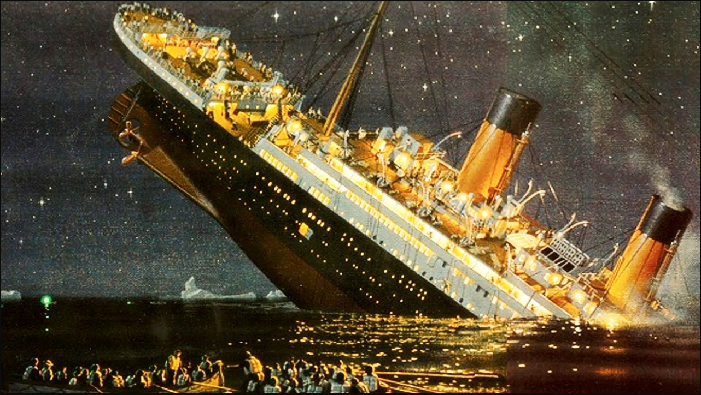

TITANIC DATASET
===============

24/03/2018

> data: https://www.kaggle.com/c/titanic/data

# PROBLEM

What kind of people are more likely to survive the RMS Titanic incident?

<p align="center"></p>

## WHY I chose this data set

* eveyone on Kaggle did it
* more features and complicated than the `IRIS` data set

```
Data Cleaness:  Clean
Pre-processing: A bit
Problem Type:   Classification
Difficulty:     Easy
```
